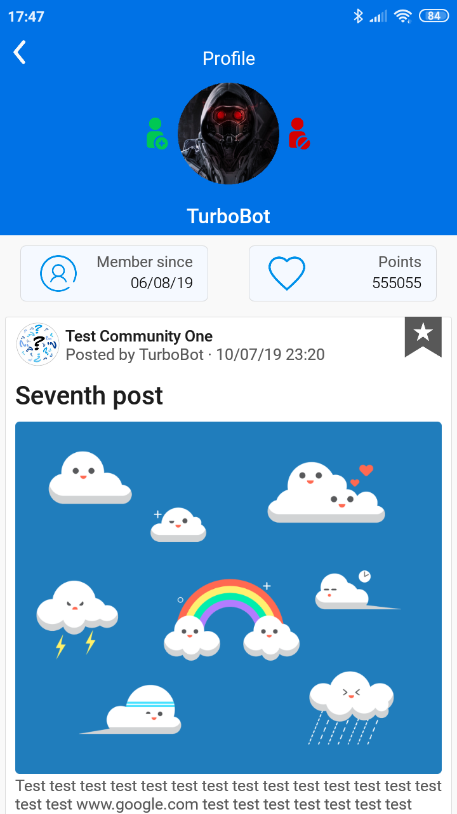
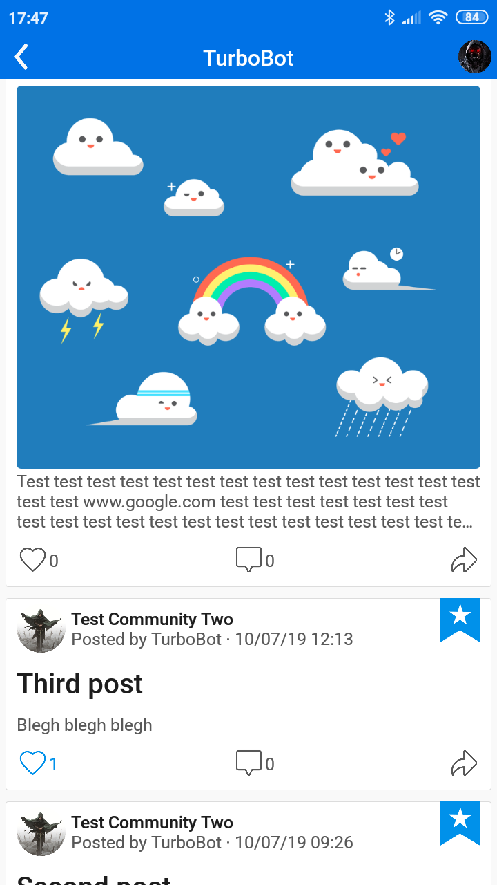

# Community Forum
 
<h2>Community forum application for Android and Web</h2>
<h3>TO DO:</h3>
<h4>1. <strike>Structure the data</strike></h4>
<h4>2. <strike>Firebase Rules</strike></h4>
<h4>3. <strike>Firebase Cloud Functions</strike></h4>
<h4>4. Android app (Currently working on)</h4>
<h4>5. JS app</h4>

 

