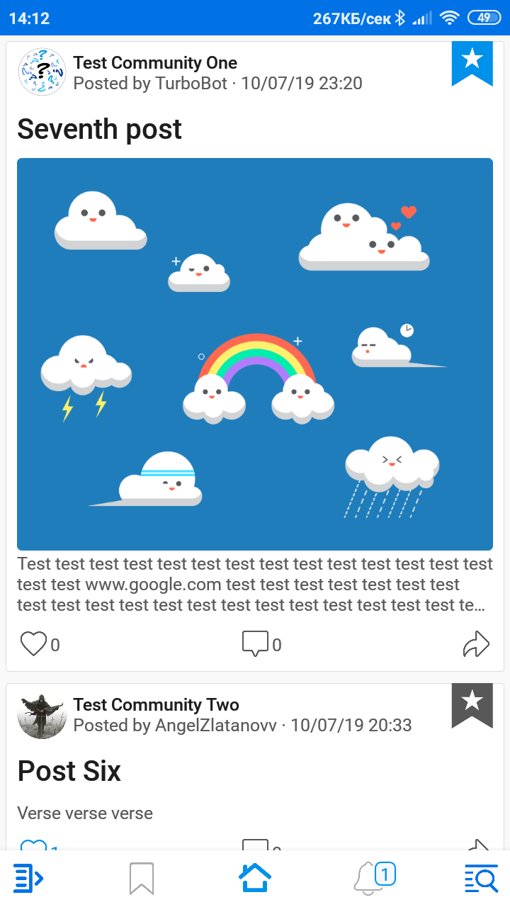

# Community Forum
 
<h2>Community forum application for Android and Web</h2>
<h3>TO DO:</h3>
<h4>1. <strike>Structure the data</strike></h4>
<h4>2. <strike>Firebase Rules</strike></h4>
<h4>3. <strike>Firebase Cloud Functions</strike></h4>
<h4>4. Android app (Currently working on)</h4>
<h4>5. JS app</h4>
The android application may need some optimization with HashMaps for users and communities avatars (<String, String>), because they make high traffic, when they can be stored in the UIHelper. 
They may even be cached but then must be added avatarChanged field, because we must update them when changed. 
